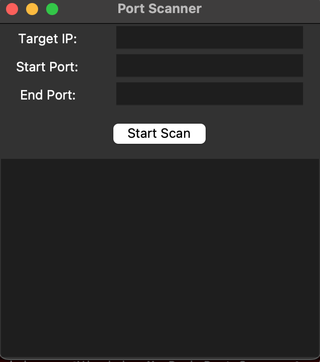

# Port_Scanner
Ever wondered what’s going on behind the scenes when devices talk to each other? This project is a multithreaded Python port scanner wrapped in a clean, friendly Tkinter GUI. It’s simple enough for beginners, fast enough to feel cool, and colourful enough to keep things fun.

# FEATURES
🖥️ Graphical User Interface (Tkinter)  
No terminal commands needed — enter your target and ports directly in the app.

⚡ Multithreaded Scanning  
Each port is scanned in its own thread for faster results.

🎨 Color‑coded Output
Green → Open ports
Red → Closed ports
Blue → Info messages

🧠 Beginner‑friendly codebase  
Clean, readable Python code ideal for learning.

# HOW IT WORKS
This scanner uses Python’s socket library to attempt TCP connections to each port in your chosen range.
If the handshake succeeds → OPEN  
If it fails → CLOSED
Multithreading lets each port scan run independently, so the GUI stays smooth and responsive.
Think of it like sending out a tiny army of digital scouts.

# INSTALLATION
1. Clone the Repository 
https://github.com/chantycodes/Port_Scanner/edit/main/README.md

2. Run the Scanner
No extra installs needed — Tkinter and sockets come with Python.

# GUI PREVIEW
Below is a screenshot showing a simple GUI made with Python Tkinter

# PROJECT STRUCTURE
scanner.py - Main GUI + multithreaded port scanner
README.MD - You are reading this right now!

# Technologies used
Python 3
Tkinter (GUI)
Socket library
Threading

# LICENSE
This is an open-source project that is free for learning and educating,so do be shy to build on it, break it down and add on to it or make it even better!!

